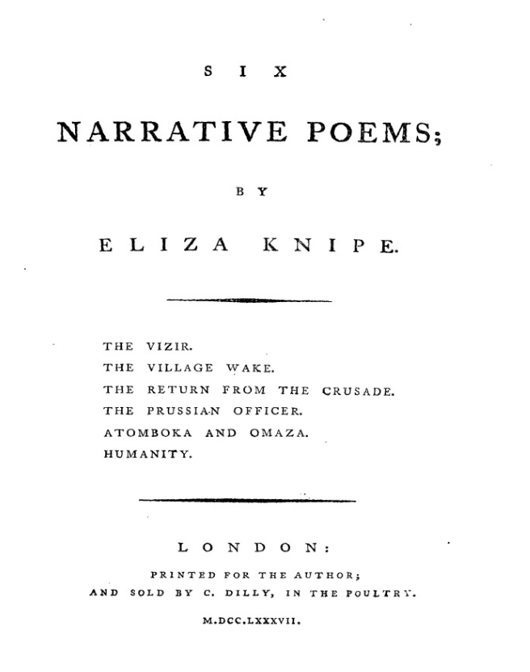
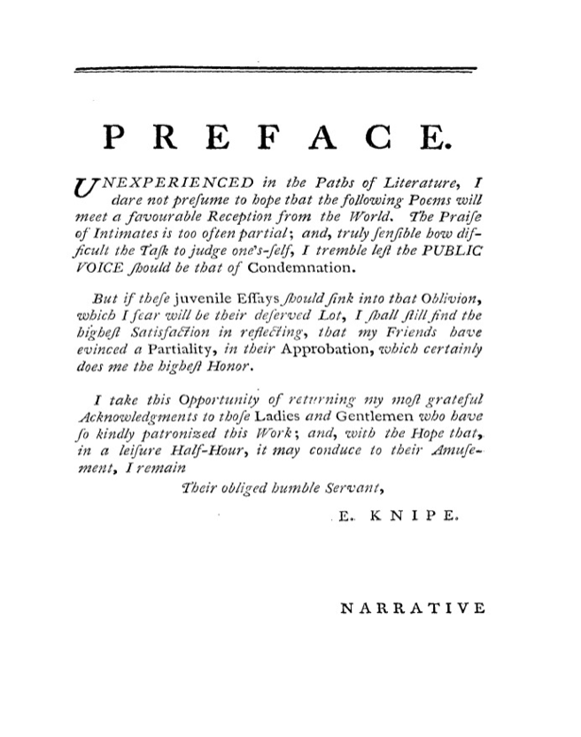
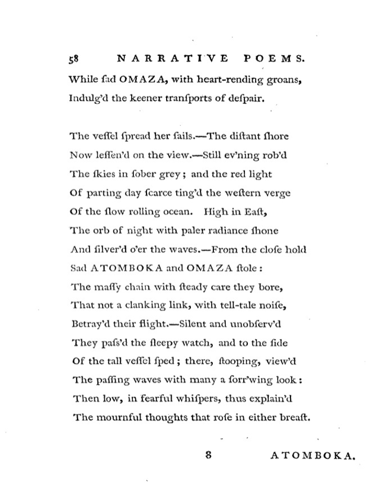

# Six narrative poems; by Eliza Knipe. The vizir. The village wake. The return from the crusade. The prussian officer. Atomboka and omaza. Humanity. 
Author: Cobbold, Elizabeth. (1765 – 1824) 

Published in: London, M.DCC.LXXXVII. [1787]

83 pages.
 
Sold by C. Dilly

Dedicated to Sir Joshua Reynolds

# Introduction

## Eliza Knipe/Elizabeth Cobbold
1765 - 1824

"In 1783 the family was in Manchester and Elizabeth's first collection of poetry was published there. She met Sir Joshua Reynolds in a London bookshop and dedicated her third work, *Six Narrative Poems*, to him in 1787; four years later, when her fourth work appeared, the Knipes were at Liverpool and there Elizabeth married William Clarke (bap. 1731, d. 1791) at St Ann's Church on 16 November 1790."

"Her second husband, John Cobbold (1746–1835), was a prosperous Ipswich brewer and banker, a pillar of the established church and the blue party and only twenty years her senior."

"An engaging speaker, Elizabeth founded, presided over, and raised funds for her Ipswich charities: the lying-in charity, the Society for Clothing the Infant Poor, and the annual charity bazaar."

"From 1806 the highlight of each year at Cliff House was the valentine party for which Cobbold employed her greatest skill in advance: designing and making up to eighty scissors-cut valentines to present to each of the unmarried guests and mounting them with an appropriate poem on red or blue paper."

"The valentine parties ran until 1822 when Elizabeth Cobbold was prevented by illness from holding one as usual, and two years later she was struck down by 'an alarming illness' in July, which, returning in October, rendered her unconscious for the week before she died on 17 October 1824."

"Elizabeth's portrait conveys a comfortable, lovable personality; posthumous tributes praised her very diverse skills, but it is only the productions of her scissors that have enduring merit."

Blatchley, J.M. "Cobbold [née Knipe; other married name Clarke], Elizabeth." *Oxford Dictionary of National Biography*. 2014. Web

## "Thesis"
While Knipe is best known as a cut paper artist, her collection of *Six Narrative Poems* deserves critical attention for its interaction with the movement to abolish slavery in Liverpool.

## Atomboka and omaza

## Liverpool context

## The Anti-Slavery Society

# Subscription List
## Total
312
## Gender
Male: 230 (74%)

Female: 82 (26%)
### Mr. & Messrs.
188 (60%)
### Esq.
20 (6%)
### Miss
42 (13%)
### Mrs.
38 (12%)
### Lady
2 (0.6%)

Lady Kent, Lady Lewes
## Reverends
15 (5%)
## Captains
2 (0.6%)

Captains Preston and Stratton
## Ensigns
1 (0.3%)

Ensign Jones
## Doctors
1 (0.3%)

Doctor Currie
## M. P.
3 (1%)

Sir Watkin Lewes, C. Taylor, Esq., _ Williams, Esq.

# Subscribers of Interest
## Public Figures
### Sir Watkin Lewes, M. P. and Lady Lewes
Sir Watkin Lewes (1740-1821), Lord Mayor of London, and Lady Rebecca Eleanora Lewes

Evans, John James. "LEWES, Sir WATKIN (1740 - 1821), lord mayor of London" *Dictionary of Welsh Biography*
## The literary circle of Rushton, Roscoe, and Currie
### Mr. Edward Rushton
Edward Rushton (1756–1814), poet and slavery abolitionist in Liverpool

### Mr. William Roscoe
William Roscoe (1753–1831), patron of the arts, historian, slavery abolitionist in Liverpool

### Doctor Currie
James Currie (1756-1805), surgeon

DeLacy, Margaret. "Currie, James." *Oxford Dictionary of National Biography*. 2004. Web
## Other artists and Literary Figures
### Willaim Hayley, Esq.
### George Romney, Esq.
## Other Abolitionists
### Rev. _ Newton
## Slave traders
### Mr. Robert Norris
### Mr. Manesty
## Misc.
### Mr. John Braithwaite
John Braithwaite the elder (bap. 1760, d. 1818), engineer and diver

- Made a living salvaging shipwrecks using his family's diving machine

"Between August 1787 and February 1791 Braithwaite brought up goods from the East Indiaman Hartwell, wrecked after a mutiny on her maiden voyage in 1787 on the Rifona Reef off Boavista, one of the Cape Verde Islands. As well as facing technical challenges the Braithwaites here encountered armed opposition from American privateers seeking to raid the salvaged cargo... The tiny Endeavour, lightly armed and with a crew of only nine, engaged the five pirate vessels for over an hour, finally driving them off at the cost of only minor injuries. Braithwaite returned with £38,000 in Spanish dollars, 7000 pigs of lead, and 360 boxes of tin. He also brought back Eliza or Elizabeth Doile (c.1775–1814), a Verdian planter's daughter, and they married at St Pancras parish church on 3 June 1794, the anniversary of the Boavista skirmish."

Braithwaite, William Ronald. "Braithwaite, John, the elder." *Oxford Dictionary of National Biography*. 2004. Web
### Mrs. Griffith
Elizabeth Griffith (1727–1793), playwright and novelist

- had a spirited correspondence with Richard Griffith (unrelated), who had charm and connections but no money. They married in secret despite the financial difficulties involved, and Elizabeth pushed herself to publish plays and novels in London.

"It was at this point of financial desperation that the Griffiths decided to publish their courtship letters under fictional names. A Series of Genuine Letters between Henry and Frances appeared in 1757, causing an immediate literary sensation. As a model example of sentimental romance blended with witty exchange and moral bite, the letters established the fame but not the fortune of their authors."

"While Griffith's writing is spritely and shows a sure sense of dramatic pace, critical reactions were extremely harsh. The London theatrical establishment resented the audacity of a woman playwright's claims for respect and admiration. If Griffith was to be able to support her children as a playwright, she would have to conform to contemporary sexual stereotypes rather than challenge the orthodoxy."

From Griffith's own preface to *Novellettes, selected for the use of young ladies and gentlemen, written by Dr Goldsmith, Mrs Griffith …*: "Mrs. GRIFFITH, the ornament and pride of her country, has strove to open the flood-gate of Literature to her own Sex, and purifying the stream from the filth with which it was impregnated to make it guide [sic] with meandering invitation through the vallies of Britain. She is one of the many examples in the present day, that have served to explode the illiberal assertion that Female genius is inferior to Male."

Eger, Elizabeth. "Griffith, Elizabeth." *Oxford Dictionary of National Biography*. 2009. Web
### Mr. William Miller
William Miller (c. 1740–c. 1810), painter.

"He specialized in history paintings but also exhibited portraits, landscapes, and genre subjects."

O'Donoghue, F.M and Hargraves, Matthew. "Miller, William." *Oxford Dictionary of National Biography*. 2004. Web
### Mr. Sadler
John Sadler (1720-1789), printer based in Liverpool.

"Sadler, John." *Oxford Dictionary of National Biography*. 2004. Web
### Mr. Matthew Turner
Matthew Turner (d. 1789), chemist, radical theologian, surgeon, and teacher based in Liverpool.

"His activities and accomplishments were numerous and diverse, though he is best remembered for his relationship with Wedgwood and his theological dispute with Priestley."

Carlyle, E.I. and Knox, Kevin C. "Turner, Matthew." *Oxford Dictionary of National Biography*. 2004. Web
### Mr. Richard Wainwright
Richard Wainwright (bap. 1757, d. 1825), chorister and musician of multiple instruments in Liverpool.

"He was also apparently a cellist at the Manchester Gentlemen's Concerts, and may have been both the Mr Wainwright who led many local performances of Handel's oratorios as first violinist, and the one who at the Liverpool and Manchester music festivals between 1784 and 1789 variously played in the orchestra, played the organ, and conducted."

Drage, Sally. "Wainwright family." *Oxford Dictionary of National Biography*. 2004. Web
### Henry Zinck, Esq.
"Henry Zinck, of Liverpool, merchant" listed in the Bankrupts section of "Monthly Chronicle" within *The European Magazine, and London Review,* Volume 5
